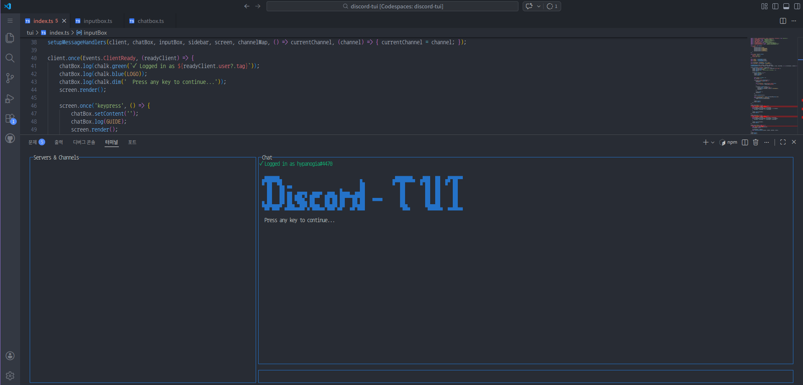
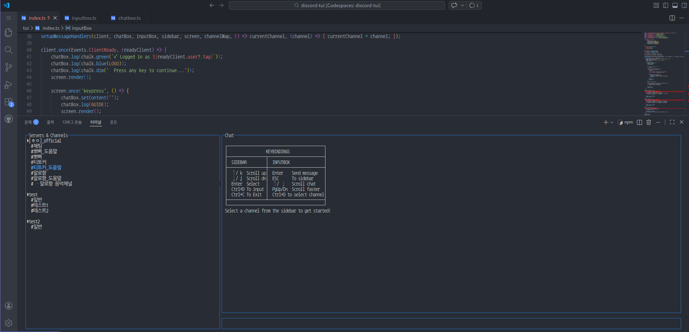

# Discord in Terminal
> Building



## Setup

### 1. Create Discord Bot
1. Go to [Discord Developer Portal](https://discord.com/developers/applications)
2. Click "New Application"
3. Go to "Bot" tab → "Reset Token" → Copy token
4. Go to "Bot" tab → Enable "Presence Intent", "Server Members Intent" ,"Message Content Intent" (Privileged Gateway Intents)

### 2. Configure Project
[Install NodeJS](https://nodejs.org/en/download)

```bash
npm install
npm run setup 
```
→Enter your Discord bot token

### 3. Invite Bot to Server
1. Go to "OAuth2" → "URL Generator"
2. Select scopes: `bot`
3. Select permissions: 
   - View Channels
   - Send Messages
   - Read Message History
4. Copy generated URL and open in browser
5. Select server and authorize

### 4. Run
```bash
npm run dev
```
