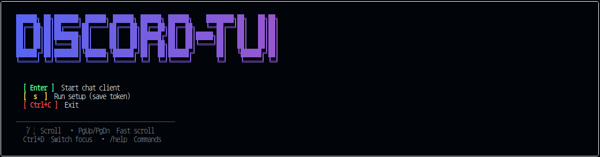

# Discord in Terminal


## Setup

### 1. Create Discord Bot
1. Go to [Discord Developer Portal](https://discord.com/developers/applications)
2. Click "New Application"
3. Go to the application settings and customize your bot profile (name, icon, description) before adding it to a server.
4. Go to "Bot" tab → "Reset Token" → Copy token
5. Go to "Bot" tab → Enable "Presence Intent", "Server Members Intent" ,"Message Content Intent" (Privileged Gateway Intents)

### 2. Install Dependencies
[Install NodeJS](https://nodejs.org/en/download)

```bash
npm install
```

### 3. Run the Application

**Development Mode** (with hot reload):
```bash
npm run dev
```

**Production Mode** (build first, then run):
```bash
npm run build
npm link
discord-tui
```

After running `npm link`, `discord-tui` becomes available globally. You can start it from any directory.

The launcher screen will appear. Press `s` to enter setup and paste your Discord bot token.

The setup process creates a `.env` file in the project root. It stores your bot token as:

```env
DISCORD_BOT_TOKEN=your-token-here
```

## Known Limitation

To prevent layout distortion in the terminal UI, emoji in channel and server names are not rendered in TUI labels (sidebar, title, and chat header). This is a display-only safeguard: internal Discord channel matching still uses the original names.

### 4. Invite Bot to Server
1. Go to "OAuth2" → "URL Generator"
2. Select scopes: `bot`
3. Select permissions: 
   - View Channels
   - Send Messages
   - Read Message History
4. Copy generated URL and open in browser
5. Select server and authorize
